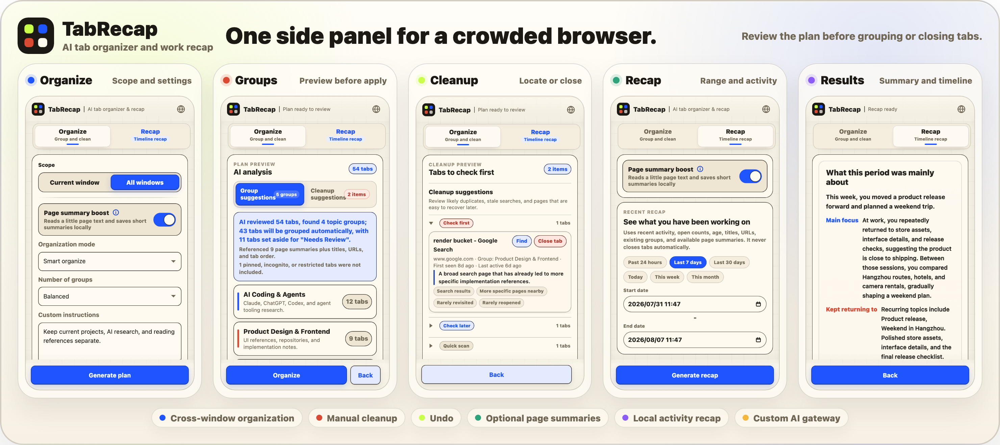

# TabRecap

<p align="center">
  
</p>

<p align="center">
  <strong>English</strong> · <a href="README.zh-CN.md">简体中文</a>
</p>

<p align="center">Chrome tab organization and recent activity recaps</p>

<p align="center">
  <a href="manifest.json"></a>
  <a href="https://github.com/sylvanyu-io/tab-recap/actions/workflows/ci.yml"></a>
  <a href="package.json"></a>
  <a href="worker/README.md"></a>
</p>

TabRecap is a Chrome MV3 side-panel extension. The Organize view groups tabs from the current window or across all windows. The Recap view turns locally recorded tab activity into a short account of recent work.

Every organization plan is shown before it runs. The extension validates the plan locally; cleanup results remain suggestions until a tab is closed manually.

<p align="center">
  
</p>

## Usage

Organize and Recap keep separate progress, so one task does not block the other.

Organize starts with the current window. After analysis, the preview shows proposed groups, unclassified pages, and cleanup candidates. Cross-window mode moves eligible tabs into one window. An undo snapshot records tab order, groups, pinned state, and window placement.

Recap covers the past 24 hours, today, this week, this month, the last 7 or 30 days, or a custom range. Its summary, timeline, and themes come from activity the extension actually observed. It is not a replacement for Chrome history.

## Planner input

Pages from the same domain often belong to unrelated tasks. A GitHub issue, pull request, documentation page, and project board all come from `github.com`, so domain-only grouping is rarely useful. TabRecap sends the planner a compact record containing:

- tab titles, hostnames, sanitized URLs, window membership, and original order;
- existing groups, pinned state, and restricted-page state;
- first-seen time, recent activity, visit count, and estimated dwell time;
- navigation sequences and transitions between tabs;
- organization instructions entered in the side panel.

Activity is supporting evidence. Titles, page meaning, original order, and user instructions carry more weight. Returned plans must pass local schema and scope checks before they can change a tab or window.

## Page access and privacy

Normal organization uses tab metadata. The Chrome Web Store build has no script-injection permission and cannot read page bodies.

Development builds can expose optional page summaries. When enabled, TabRecap reads a small amount of visible text from authorized, awake, non-incognito pages. It does not read passwords, form values, cookies, local storage, or full HTML. Unauthorized pages remain title-and-URL only.

Tab activity, transitions, settings, and undo data stay in Chrome extension storage. Starting an organization or recap request sends the compact data needed for that job to the selected model service. See the [privacy policy](PRIVACY.md) for retention, gateway rate limiting, and the complete data boundary.

Chrome suspends MV3 background workers. TabRecap records activity when the extension starts, tabs change, windows switch, or an alarm wakes the worker. Depending on page state and permission, a record may contain only a title and URL or may be skipped.

## Local installation

```bash
npm install
npm run assets:icons
npm run build
```

Open `chrome://extensions`, enable **Developer mode**, click **Load unpacked**, and select `dist/extension`. The toolbar icon opens TabRecap in Chrome's right side panel.

## Models and gateways

Leaving the gateway URL and key empty selects the built-in service. Advanced settings accept a Chat Completions-compatible endpoint, API key, and model name.

The default model is `gpt-5.4` with high reasoning effort. Built-in presets include:

- `gpt-5.4`
- `gpt-5.5`
- `gpt-5.4-mini`
- `claude-opus-4-8`
- `claude-sonnet-4-6`

A custom gateway can use a model outside this preset list. For example, a compatible GLM setup can use `https://open.bigmodel.cn/api/paas/v4` with `glm-5.2`.

Do not commit gateway keys. Rotate any key exposed in chat, logs, screenshots, shell history, or test output.

## Development and release

Run the regular test suites:

```bash
npm test
npm run test:ui
```

Release gates:

| Command | Checks |
| --- | --- |
| `npm run release:check` | Tests, secret scans, dev/store builds, artifact audit |
| `npm run release:check:full` | Standard gate plus an isolated Chromium extension stress run |
| `npm run release:publish-check` | Full gate plus package version and Git tag checks |
| `npm run release:check:live` | Full gate plus the default gateway, Tunnel, monitor state, and a real model request |

The live gate reads `MONITOR_TOKEN` or `MONITOR_TOKEN_FILE`. GitHub Actions runs the standard gate on pushes and pull requests. To repeat the extension stress run remotely, dispatch the `CI` workflow with `full_gate` enabled.

Generate documentation images and the store package:

```bash
npm run assets:readme
npm run assets:store
npm run build:extension:store
```

A tagged release produces `dist/tab-recap-<version>-store.zip`. Untagged filenames include the commit identity and add `dirty` when the worktree has changes. Store packages stay local and are excluded from GitHub artifacts and release assets. Dashboard copy and image paths are listed in [Chrome Web Store listing](docs/store-listing.md).

## Stress test

```bash
npm run build
npm run stress:extension
```

The stress run creates several windows and hundreds of pages in an isolated Chromium profile. It covers current-window organization, cross-window consolidation, apply/undo, and page-summary permission boundaries.

Enable the real gateway branch:

```bash
STRESS_GATEWAY=1 STRESS_GATEWAY_TABS=60 npm run stress:extension
```

For a custom gateway, pass its URL, model, and key:

```bash
STRESS_GATEWAY=1 \
GATEWAY_BASE_URL=https://example.com/v1 \
GATEWAY_API_KEY="$CUSTOM_GATEWAY_API_KEY" \
GATEWAY_MODEL=your-model \
STRESS_GATEWAY_TABS=60 \
npm run stress:extension
```

## Architecture

```text
Chrome tabs/windows
        |
        v
tab inventory + URL sanitization + original order
        |
        v
optional cached page-summary signals
        |
        v
local activity log and recap input
        |
        v
AI gateway planner
        |
        v
local validation + preview
        |
        v
Chrome executor + undo snapshot
```

## Documentation

- [Documentation index](docs/README.md)
- [Benchmarks and decision records](docs/benchmarks/README.md)
- [Gateway Worker](worker/README.md)
