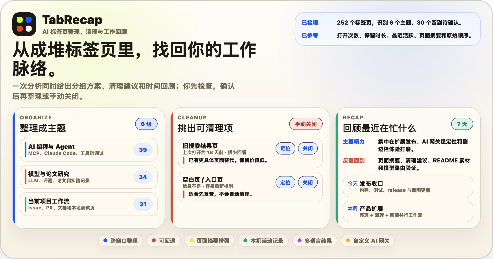

# TabRecap

<p align="center">
  
</p>

<p align="center">
  <a href="README.md">English</a> · <strong>简体中文</strong>
</p>

<p align="center">Chrome 标签页整理与近期工作回顾</p>

<p align="center">
  <a href="manifest.json"></a>
  <a href="https://github.com/sylvanyu-io/tab-recap/actions/workflows/ci.yml"></a>
  <a href="package.json"></a>
  <a href="worker/README.md"></a>
</p>

TabRecap 是一个 Chrome MV3 侧边栏扩展。整理页按任务重排当前窗口或全部窗口的标签页。回顾页读取保存在本机的活动记录，生成近期摘要。

整理前会显示完整预览。分组方案在本地校验通过后才会执行；清理列表只提供候选，关闭标签页仍需手动确认。

<p align="center">
  
</p>

## 用法

侧边栏里有“整理”和“回顾”两个页面。进度分开保存，运行互不阻塞。

整理默认只处理当前窗口。分析完成后，可以检查建议分组、待分类页面和清理候选，再决定是否应用。跨窗口模式会把符合条件的标签页移到一个窗口；回退快照用于恢复顺序、分组、固定状态和窗口位置。

回顾支持过去 24 小时、本日、本周、本月、最近 7 天、最近 30 天和自定义范围。结果包含简要总结、时间线和主题。它依赖扩展运行期间留下的活动记录，因此只是一份近期工作线索，不等同于完整的 Chrome 历史记录。

## 分组依据

同一个域名里往往混着不同任务。GitHub Issue、PR、文档和项目面板都来自 `github.com`，按域名分组没有太大用处。TabRecap 会把下面这些信息压缩后交给模型：

- 标签页标题、域名、脱敏后的 URL、窗口和原始顺序；
- 已有分组、固定状态、受限页面状态；
- 首次出现、最近活跃、打开次数和估算停留时间；
- 连续访问、返回路径和标签页之间的切换关系；
- 用户填写的分组要求。

使用关系只是一项参考。标题、页面语义、原始顺序和用户要求仍是主要依据。模型返回的结果必须通过本地 schema 和范围检查，不能把操作导向分析范围之外的窗口或标签页。

## 页面内容与隐私

普通整理只需要标签页元数据。Chrome Web Store 构建不包含脚本注入权限，无法读取网页正文。

开发构建可以显示页面摘要选项。开启后，扩展只读取已授权、未休眠、非无痕页面的少量可见文字；密码、表单内容、Cookie、本地存储和完整 HTML 不在读取范围内。未授权页面继续使用标题和网址。

标签页活动、切换记录、设置和回退信息保存在 Chrome 扩展存储中。发起整理或回顾时，完成任务所需的精简信息会发送到当前选择的模型服务。详细的数据范围、保留时间和网关限流方式见[隐私政策](PRIVACY.md)。

Chrome 会暂停 MV3 后台进程，所以活动记录采用尽力而为的方式：扩展在启动、标签页变化、窗口切换和定时唤醒时补记状态。根据权限与页面状态，这些记录可能只保留标题和网址，或直接跳过。

## 本地安装

```bash
npm install
npm run assets:icons
npm run build
```

在 Chrome 中打开 `chrome://extensions`，开启 Developer mode，点击 **Load unpacked**，选择 `dist/extension`。点击扩展图标后，侧边栏会从浏览器右侧打开。

## 模型与网关

网关地址和密钥留空时使用内置服务。高级设置接受兼容 Chat Completions 的自定义地址、密钥和模型名。

默认模型为 `gpt-5.4`，默认思考强度为高。内置预设包括：

- `gpt-5.4`
- `gpt-5.5`
- `gpt-5.4-mini`
- `claude-opus-4-8`
- `claude-sonnet-4-6`

使用自定义网关时，模型名不受这份预设列表限制。例如 GLM 可以填写 `https://open.bigmodel.cn/api/paas/v4` 和 `glm-5.2`，前提是所用网关兼容当前请求格式。

不要提交网关密钥。密钥一旦出现在聊天、日志、截图、shell history 或测试输出中，应立即轮换。

## 开发与发布

日常测试：

```bash
npm test
npm run test:ui
```

发布门禁：

| 命令 | 检查内容 |
| --- | --- |
| `npm run release:check` | 测试、密钥扫描、开发包与商店包构建、产物审计 |
| `npm run release:check:full` | 标准门禁，加隔离 Chromium 扩展压力测试 |
| `npm run release:publish-check` | 完整门禁，加版本号与 Git tag 检查 |
| `npm run release:check:live` | 完整门禁，加默认网关、Tunnel、监控和真实模型请求 |

在线门禁读取 `MONITOR_TOKEN` 或 `MONITOR_TOKEN_FILE`。GitHub Actions 在 push 和 PR 上运行标准门禁；手动触发 `CI` workflow 并勾选 `full_gate`，可以在远端复跑扩展压力测试。

生成图片和安装包：

```bash
npm run assets:readme
npm run assets:store
npm run build:extension:store
```

正式 tag 上构建的商店包位于 `dist/tab-recap-<version>-store.zip`。非 tag 构建会在文件名中加入 commit 标识，工作区不干净时还会加上 `dirty`。商店包只在本地生成，不作为 GitHub Artifact 或 Release Asset 上传。商店文案和截图路径见 [Chrome Web Store listing](docs/store-listing.md)。

## 压力测试

```bash
npm run build
npm run stress:extension
```

测试会在隔离 Chromium profile 中创建多个窗口和数百个页面，覆盖当前窗口整理、跨窗口合并、应用与回退、页面摘要权限边界。

启用真实网关分支：

```bash
STRESS_GATEWAY=1 STRESS_GATEWAY_TABS=60 npm run stress:extension
```

测试自定义网关时传入地址、模型和对应密钥：

```bash
STRESS_GATEWAY=1 \
GATEWAY_BASE_URL=https://example.com/v1 \
GATEWAY_API_KEY="$CUSTOM_GATEWAY_API_KEY" \
GATEWAY_MODEL=your-model \
STRESS_GATEWAY_TABS=60 \
npm run stress:extension
```

## 架构

```text
Chrome tabs/windows
        |
        v
标签页清单 + URL 脱敏 + 原始顺序
        |
        v
可选缓存/页面短摘要信号
        |
        v
本机活动记录和时间回顾
        |
        v
AI 网关规划器
        |
        v
本地校验 + 预览
        |
        v
Chrome 执行器 + 回退快照
```

## 文档

- [文档索引](docs/README.md)
- [基准与决策记录](docs/benchmarks/README.md)
- [Gateway Worker](worker/README.md)
